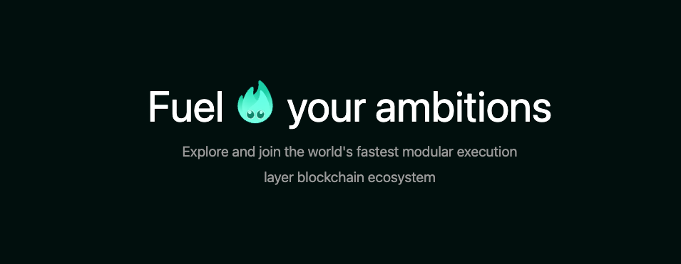

## Fuel.build




Go beyond monolithic and explore projects building on [Fuel](https://www.fuel.network/).

### Contribute

We'll need [pnpm](https://pnpm.io/) installed on our local machine. Follow the instructions [here](https://pnpm.io/installation) then install dependencies.

```sh
$ pnpm install
```

Then to add your project, please follow the documentation [`docs/fill-up-gas-station.md`](./docs/fill-up-gas-station.md)
